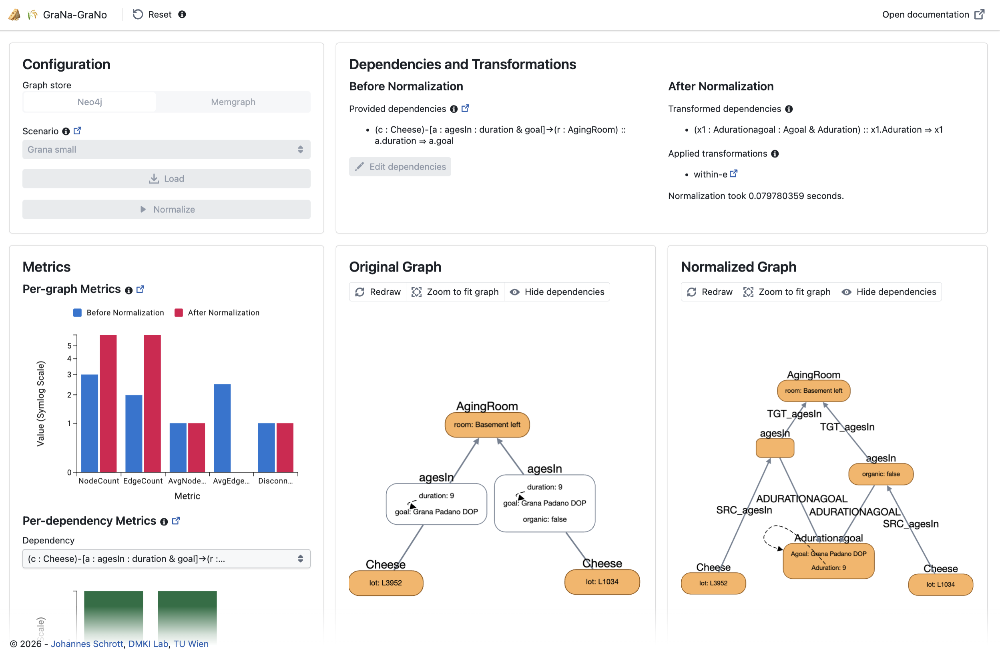

# Welcome to GraNa-GraNo 

GraNa-GraNo is a web-based application that allows the
visualization and normalization of LPGs. 

## Getting Started

1. Install [Docker](https://www.docker.com) including Docker Compose
2. Clone GraNa-GraNo from [GitHub](https://github.com/dmki-tuwien/grana-grano) to your host 
`bash
git clone https://github.com/dmki-tuwien/grana-grano --recurse-submodules
`
3. Start the Docker containers using 
`
docker compose --profile grana-grano up --build
`
4. GraNa-GraNo is available on <http://localhost/>! 🎉

## User Guide
GraNa-GraNo's GUI is divided into a menu bar, that allows to reset the application, and 4 blocks that become visible when using the tool.

<figure markdown="span">
  
  <figcaption>The GraNa-GraNo application (click on image to enlarge)</figcaption>
</figure>

The following steps need to be taken when using GraNa-GraNo:

1. A graph store must be selected. Currently [Neo4j](https://neo4j.com) and [Memgraph](https://memgraph.com) are supported.
1. A [normalization scenario](scenarios.md) needs to be chosen and loaded.
2. After loading [metrics](metrics.md) are computed before normalization and the provided [dependencies](dependencies.md) are listed and can be edited. A visualization of the provided graph incl. the dependencies is shown.
3. Clicking on "Normalize" normalizes the graph according to the provided dependencies.
4. After normalization, again the [metrics](metrics.md) are computed, the applied transformations and the dependencies after the [transformations](transformations.md) are shown, and the normalized graph is visualized.
