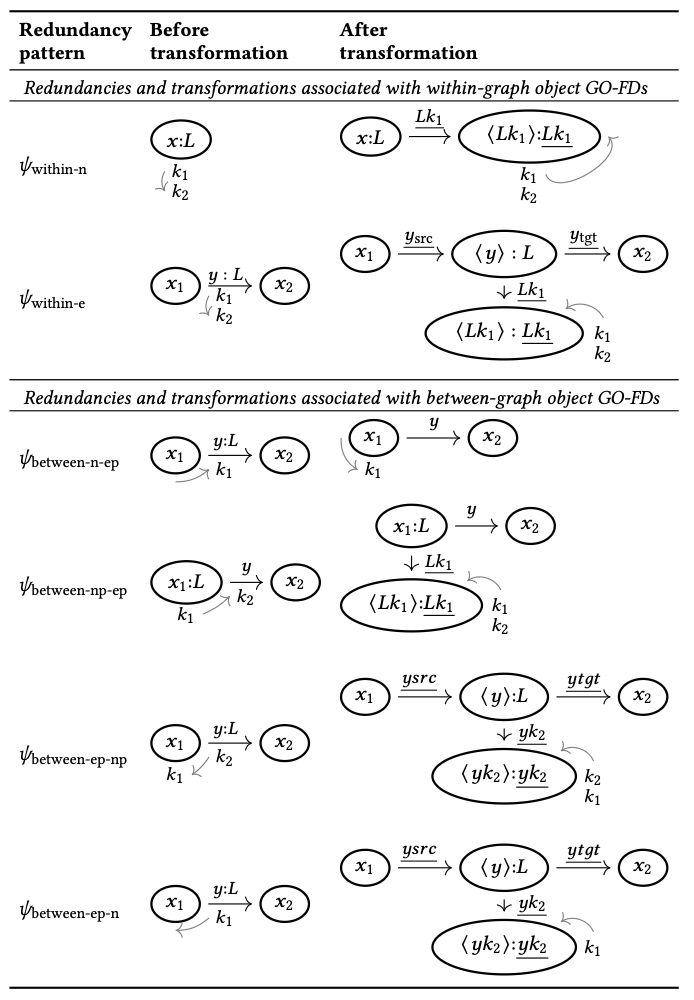

# Transformations

Based on redundancy patterns, i.e., the structure of the given [dependencies](dependencies.md), the transformations performed during graph-native normalization are selected from the following:

<figure markdown="span">
  
  <figcaption>Transformations of the graph-native normalization approach for LPGs</figcaption>
</figure>
